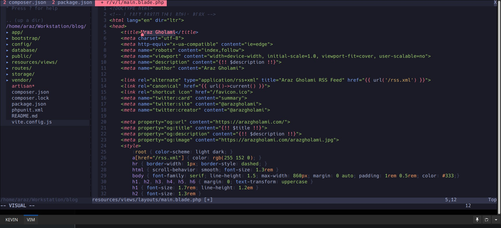

# VIMSANE
Sane VIM configuration for my personal use.



## Install VIM PLUG
```
sh -c 'curl -fLo "${XDG_DATA_HOME:-$HOME/.local/share}"/nvim/site/autoload/plug.vim --create-dirs \
       https://raw.githubusercontent.com/junegunn/vim-plug/master/plug.vim'
```

## Download to your ~/.vimrc 
```
wget "https://raw.githubusercontent.com/arazgholami/vimsane/refs/heads/main/vimrc"
cp vimrc ~/.vimrc
```

## Install/Update VIM PLUG
```
:PlugUpdate
```

## Keymap
`:` Commands <br>
`i` Insert <br>
`y` Copy (yank!), `yy` Copy whole line<br>
`d` Cut, `dd` Cut whole line<br>
`p` Paste<br>
`u` Undo<br>
`ESC` and `v` Select, `V` for line selection <br>
`qa` Close all and exit<br>
`ESC`+NUM Switch Tabs<br>
`G` Move to end of doc, `gg` Move to begining<br>
`Ctrl+t` Open tree<br>
`Ctrl+ww` Switch to Editor from Tree<br>
`Ctrl+p` Quick Open<br>
`/KEYWORD` Search<br>
`%s/KEYWORD/REPLACE-WITH/gc` Search and Replace (all, confirm before)<br>
